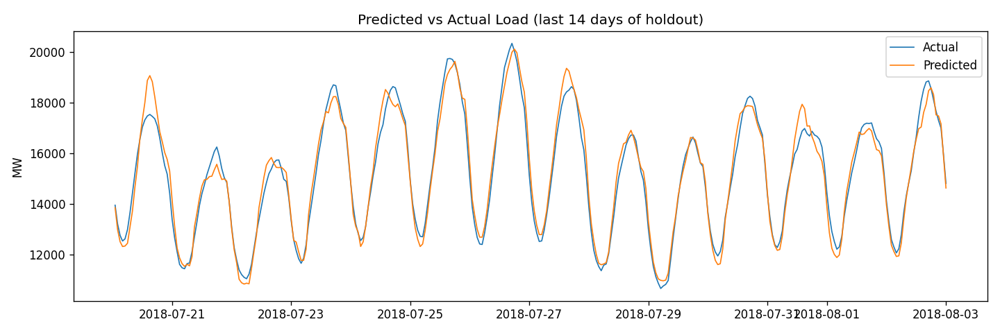

# GridCast — Hourly Electricity Load Forecasting (MLOps)

> Hourly electricity demand forecasting that beats a seasonal-naive baseline by 72% (2.7% MAPE) — reproducible MLOps pipeline with DVC, MLflow, and FastAPI.

End-to-end, **reproducible, served** machine-learning system that forecasts hourly
electricity demand (megawatts) for the AEP region of the PJM grid. The emphasis is
**production engineering**: data versioning, experiment tracking, a reproducible
multi-stage pipeline, an honest baseline, automated tests, CI, and a deployable API.

| Concern | Tool |
|---|---|
| Data & pipeline versioning | **DVC** (`dvc.yaml` stages, reproducible via `dvc repro`) |
| Experiment tracking | **MLflow** (params, per-fold metrics, artifacts per run) |
| Modeling | LightGBM, expanding-window time-series cross-validation |
| Honest benchmark | Seasonal-naive baseline + **skill score** |
| Serving | **FastAPI** inference API, containerized with **Docker** |
| Testing | **pytest** (data, features, baseline, API) |
| CI | **GitHub Actions** (lint + tests + train smoke-test + API smoke-test) |

## Headline result

On a held-out final period (~18k hours), the model beats the trivial benchmark decisively:

| Metric | Model (LightGBM) | Seasonal-naive baseline |
|---|---|---|
| MAPE | **2.67%** | 9.54% |
| MAE (MW) | **399** | 1437 |

**Skill score vs baseline: 0.72** — the model reduces mean absolute error by 72% over
"same hour, last week." Reporting against a baseline is what makes the headline number
meaningful rather than decorative.



## Problem

Forecast hourly load from a univariate series (`Datetime`, `AEP_MW`). Short-term load
forecasting is an operational function at utilities, ISOs/RTOs, and energy traders. The
raw series has two columns; predictive signal is **engineered** from calendar structure
(including cyclical encodings and US holidays) and the series' own lagged history.

## Pipeline stages (DVC DAG)

```
ingest -> clean -> features -> train -> evaluate
```

1. **ingest** — parse timestamps, sort.
2. **clean** — drop duplicate DST timestamps, enforce a continuous hourly grid, bound values.
3. **features** — calendar + cyclical (sin/cos) encodings, US holidays, lag (24/48/168h),
   rolling mean/std. Two raw columns become ~21 features.
4. **train** — LightGBM with expanding-window TS-CV; logs params/metrics/artifact to MLflow.
5. **evaluate** — model vs seasonal-naive baseline, skill score, MAE/RMSE/MAPE, and saved
   predicted-vs-actual and residual plots.

## Serving

```bash
uvicorn src.serve:app --reload
# GET  /health           -> liveness + model-loaded flag
# POST /predict          -> {"features": {...}} -> {"predicted_mw": ...}
```

Or containerized:

```bash
docker build -t aep-load-api .
docker run -p 8000:8000 aep-load-api
```

## Reproduce

```bash
pip install -r requirements.txt
dvc repro          # runs the whole DAG
dvc metrics show   # model vs baseline
mlflow ui          # compare runs at http://localhost:5000
```

See `SETUP.md` for full git/DVC/MLflow initialization and push instructions.
